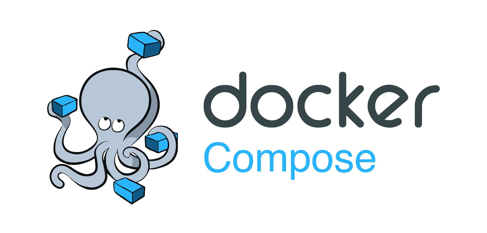
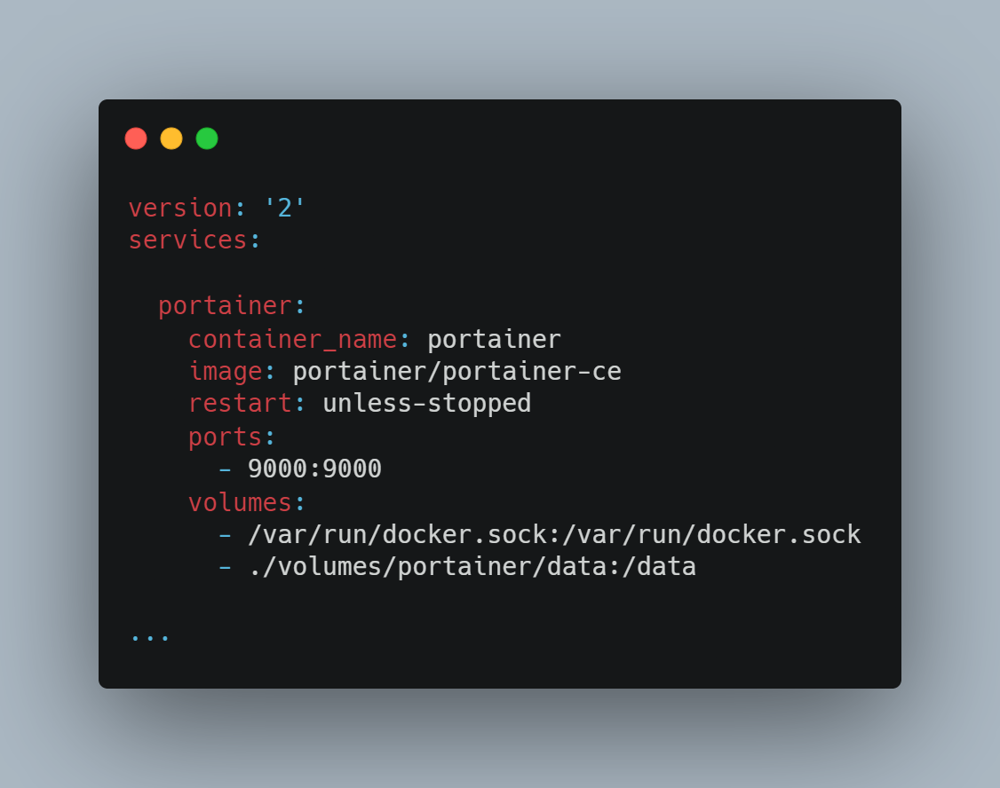
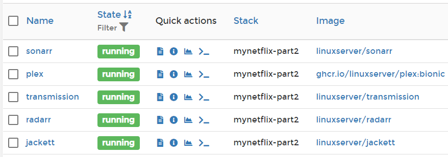

# MyNetflix

### *Ce workshop a pour but d'automatiser le téléchargement de séries / films dès leur sortie.*

### **N'hésitez pas à star ⭐ ce repo si vous avez aimé le workshop!** 

## Partie 1 : Docker Compose

**Docker Compose** est un outil qui permet de décrire (dans un fichier YAML) et gérer (en ligne de commande) plusieurs conteneurs comme un ensemble de services interconnectés.

Installez Compose si ce n'est pas déjà fait à l'aide du [tuto linuxserver](https://docs.linuxserver.io/general/docker-compose)

Vous pouvez maintenant télécharger les images que nous allons utiliser à l'aide de ``docker-compose pull``

## Partie 2 : Configuration de docker compose
Comme vous pouvez le voir dans le fichier ``docker-compose.yml`` mis à votre disposition dans le repo, il manque des paramètres pour permettre l'exécution des conteneurs.

Pour corriger ça, mettez en place la configuration recommandée grâce aux liens suivants:

| service      | Lien |
|--------------|------|
| plex         | [linuxserver/plex](https://docs.linuxserver.io/images/docker-plex)
| transmission | [linuxserver/transmission](https://docs.linuxserver.io/images/docker-transmission)
| radarr       | [linuxserver/radarr](https://docs.linuxserver.io/images/docker-radarr)  
| sonarr       | [linuxserver/sonarr](https://docs.linuxserver.io/images/docker-sonarr)
| jackett      | [linuxserver/jackett](https://docs.linuxserver.io/images/docker-jackett)

**Faites attention à bien rensigner des chemins / volumes valides.**

Une fois que tout les services sont mis en place, vous pouvez lancer la stack grâce à ``docker-compose up -d``

⚠ Pour allumer et éteindre la stack, utilisez les commandes ``docker-compose start|stop`` *up* ne sert qu'a créé les conteneurs pour la première fois.

Rendez-vous ensuite sur l'interface portainer [localhost:9000](http://localhost:9000) pour confirmer le bon déploiement des conteneurs.

✨Voilà !✨ Vous n'avez maintenant plus qu'a configurer les services pour qu'ils fonctionnenent entre eux.

## Partie 3: Configuration

Nous allons maintenant configurer les services pour qu'ils communiquent entre eux.

Rendez vous sur l'ip assignée à Jackett pour commencer. http://localhost:9117/UI/Dashboard

Appuyez sur le boutton add indexer et ajoutez le/les indexers de votre choix.

Ensuite, suivez les instruction dans "*Adding a Jackett indexer in Sonarr or Radarr*"

Dans le field **URL** sur Sonarr et Radarr, utilisez le format suivant :  
``http://{nom docker jackett}:{port jackett}/api/v2.0/indexers/all/results/torznab``  
dans mon cas:
``http://jackett:9117/api/v2.0/indexers/all/results/torznab``
Comme les dockers sont installés dans le même virtual network, on peut utiliser le hostname des conteneurs pour y accéder depuis un conteneur sur le même network

Une fois que l'indexeur est en place, rendez vous dans la section *Download Clients* pour rajouter Transmission comme client de téléchargement.

**Rensigner une catégorie** pour faire en sorte que votre client de téléchargement n'ait pas de problèmes de conflits.

Rendez vous ensuite dans *Media management* pour rajouter les "Root Folders" /tv ou /movies que avez au préalable montés dans le Docker à l'aide d'un bind/volume.

✨Voilà !✨ Vous n'avez maintenant plus qu'à ajouter des films et des séries et ils seront téléchargés et ajoutés à Plex automatiquement!

### Merci d'avoir suivi ce workshop ! J'espère qu'il vous à plu. Et encore une fois si c'est le cas n'hésitez pas à star le repo, ça fait toujours plaisir 😉

### Aller plus loin:
- Explorez les paramètres de Sonarr et Radarr pour envoyer des notifications à votre téléphone quand un épisode est téléchargé
- Changer les paramètres de Plex pour que la synchronisation s'éffectue dans le contennu d'un "watched folder" change.
- Importer des lites de séries / movies à l'aide de la foncton "import list" et d'une liste Trakt
- Intégrer un VPN à votre setup à l'aide de [wireguard](https://hub.docker.com/r/linuxserver/wireguard) pour pouvoir accéder à distance à Sonarr/Radarr.
