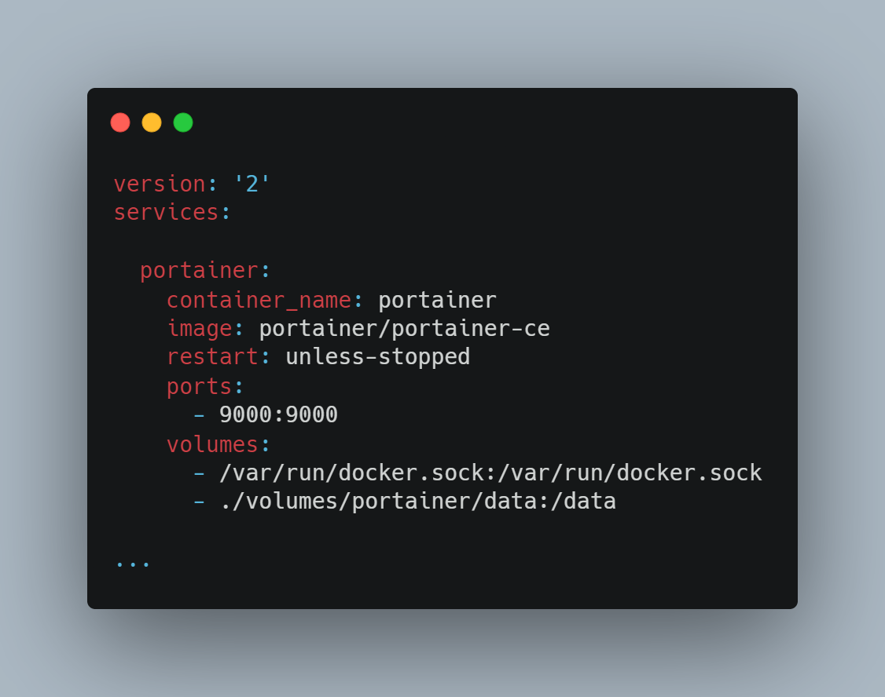

# MyNetflix

### *Ce projet a pour but de vous apprendre à automatiser le téléchargement de séries / films dès leur sortie et d'y avoir accès en local ou depuis internet. Un peu comme Netflix.*

### N'hésitez pas à star ⭐ ce repo si le projet vous plaît ! ♥ 

https://github.com/ajnart/mynetflix

## Partie 1 : Docker Compose

**Docker Compose** est un outil qui permet de décrire (dans un fichier YAML) et gérer (en ligne de commande) plusieurs conteneurs comme un ensemble de services interconnectés.

Installez Compose si ce n'est pas déjà fait à l'aide du [tuto linuxserver](https://docs.linuxserver.io/general/docker-compose)

Vous pouvez maintenant télécharger les images que nous allons utiliser à l'aide de ``docker-compose pull``

## Partie 2 : Configuration de docker compose
Comme vous pouvez le voir dans le fichier ``docker-compose.yml`` mis à votre disposition dans le repo, il manque des paramètres pour permettre l'exécution des conteneurs.

Pour corriger ça, mettez en place la configuration recommandée grâce aux liens suivants:

| service      | Lien |
|--------------|------|
| portainer    | [portainer](https://portainer.readthedocs.io/en/stable/deployment.html#deploy-portainer-via-docker-compose)
| plex         | [linuxserver/plex](https://docs.linuxserver.io/images/docker-plex)
| transmission | [linuxserver/transmission](https://docs.linuxserver.io/images/docker-transmission)
| radarr       | [linuxserver/radarr](https://docs.linuxserver.io/images/docker-radarr)  
| sonarr       | [linuxserver/sonarr](https://docs.linuxserver.io/images/docker-sonarr)
| jackett      | [linuxserver/jackett](https://docs.linuxserver.io/images/docker-jackett)

**Faites attention à bien renseigner des chemins / volumes valides.**

Une fois que tous les services sont mis en place, vous pouvez lancer la stack grâce à ``docker-compose up -d``

⚠ Pour allumer et éteindre la stack, utilisez les commandes ``docker-compose start|stop``. *Up* ne sert qu'à créer les conteneurs pour la première fois.

Rendez-vous ensuite sur l'interface portainer [localhost:9000](http://localhost:9000) pour confirmer le bon déploiement des conteneurs.

✨Voilà !✨ Vous n'avez maintenant plus qu'à configurer les services pour qu'ils fonctionnent entre eux.

## Partie 3: Configuration

Nous allons maintenant configurer les services pour qu'ils communiquent entre eux.

Rendez-vous sur l'ip assignée à Jackett pour commencer. http://localhost:9117/UI/Dashboard

Appuyez sur le bouton add indexer et ajoutez le/les indexers de votre choix.

Ensuite, suivez les instructions dans "*Adding a Jackett indexer in Sonarr or Radarr*"

Dans le field **URL** sur Sonarr et Radarr, utilisez le format suivant :  
``http://{nom docker jackett}:{port jackett}/api/v2.0/indexers/all/results/torznab``  
dans mon cas:
``http://jackett:9117/api/v2.0/indexers/all/results/torznab``
Comme les dockers sont installés dans le même virtual network, on peut utiliser le hostname des conteneurs pour y accéder depuis un conteneur sur le même network

Une fois que l'indexeur est en place, rendez-vous dans la section *Download Clients* pour rajouter Transmission comme client de téléchargement.

**Rensigner une catégorie** pour faire en sorte que votre client de téléchargement n'ait pas de problème de conflits.

Rendez-vous ensuite dans *Media management* pour rajouter les "Root Folders" /tv ou /movies que vous avez au préalable montés dans le Docker à l'aide d'un bind/volume.

✨Voilà !✨ Vous n'avez maintenant plus qu'à ajouter des films et des séries et ils seront téléchargés et ajoutés à Plex automatiquement!

### Merci d'avoir suivi ce workshop ! J'espère qu'il vous à plu. Si c'est le cas n'hésitez pas à star le repo, ça fait toujours plaisir 😉

### Aller plus loin:
- Explorer les paramètres de Sonarr et Radarr pour envoyer des notifications à votre téléphone quand un épisode est téléchargé
- Changer les paramètres de Plex pour que la synchronisation s'effectue dans le contenu d'un "watched folder" change.
- Importer des lites de séries / movies à l'aide de la fonction "import list" et d'une liste Trakt
- Intégrer un VPN à votre setup à l'aide de [wireguard](https://hub.docker.com/r/linuxserver/wireguard) pour pouvoir accéder à distance à Sonarr/Radarr.
- Intéger transmission à votre navigateur: [addon chrome](https://chrome.google.com/webstore/detail/transmission-easy-client/cmkphjiphbjkffbcbnjiaidnjhahnned?hl=en)
